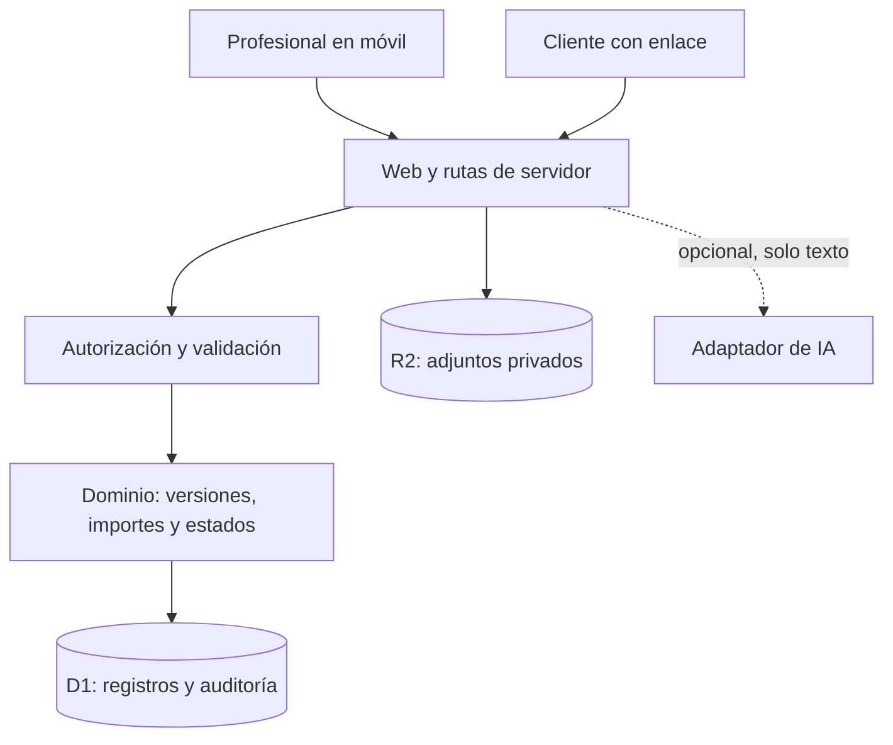

# ExtraClaro — Arquitectura y plan de construcción

Fecha: 9 de septiembre de 2026. Estado: MVP web implementado y probado localmente; publicación privada en preparación. Sin usuarios comerciales.

## 1. Objetivo y alcance

Que una pequeña empresa de reformas pueda acordar cada trabajo adicional con su cliente antes de ejecutarlo. Flujo: obra → borrador de extra → revisión del profesional → enlace compartido → decisión del cliente → ejecución → cobro registrado.

Hipótesis comercial: empresas de 2–10 personas pagarán 39 €/mes por reducir olvidos y desacuerdos. Precio, demanda y canales pendientes de validación. Los testimonios de X son señales cualitativas, no prueba de mercado.

Implementado: interfaz móvil, obras y extras persistentes, edición de borradores, envío con versión congelada, enlaces de revisión, aprobación/rechazo, nuevas versiones, anulación, ejecución, cobro manual e historial. Exportación JSON por obra e impresión de la revisión para guardar PDF desde el navegador. Adjuntos, PDF generado en servidor, gestión multiusuario de empresas y acceso comercial público siguen pendientes.

## 2. Decisiones principales

- Monolito modular: una aplicación y una base de datos. No microservicios.
- Web móvil primero; cliente accede mediante enlace, sin instalar app.
- Importes en céntimos enteros, nunca aritmética monetaria con decimales binarios.
- Cada envío conserva una versión inmutable del alcance, precio y plazo.
- La IA solo propone texto. Nunca decide precios, impuestos, permisos ni aprobaciones.
- Compartir mediante enlace manual en WhatsApp durante el MVP; sin bot ni lectura automática de conversaciones.
- Marcar un cobro es un registro manual, no confirma una transferencia bancaria.
- Separar estado comercial de ejecución y cobro en el modelo persistente para futuras cancelaciones y pagos parciales. El módulo inicial simplifica el camino feliz a una máquina de estados.

## 3. Stack previsto

La interfaz se inicializará con el starter de Sites (Vinext/React, TypeScript, componentes Shadcn y Vite), preservando su estructura y versiones generadas. El servidor utilizará las rutas del mismo proyecto, compatible con Cloudflare Workers. D1 almacenará datos relacionales; R2 almacenará adjuntos privados. D1 está declarado y tiene migraciones. R2 no se ha activado porque los adjuntos siguen pendientes.

Autenticación implementada para el prototipo privado: Sign in with ChatGPT mediante los helpers de Sites. Cada identidad tiene un espacio independiente mediante owner_id. La plataforma publica inicialmente solo para el propietario, por lo que un cliente externo no podrá abrir el enlace todavía. Antes de abrir el piloto comercial hay que resolver el acceso externo y la membresía de empresa; no asumir que todos los reformistas tienen cuenta de ChatGPT. No hay contraseñas propias.

El dominio inicial es JavaScript ESM sin dependencias, ejecutable con Node. Puede importarse desde la futura aplicación TypeScript. Pruebas con el runner integrado de Node. El sitio está inicializado en web/. Se mantienen los módulos de dominio dentro de web/lib/domain para que el código publicado sea autocontenido.

## 4. Componentes



Capas: presentación → servicios de aplicación → dominio → repositorios. El dominio no conoce HTTP, SQL, proveedores de IA ni almacenamiento. Los servicios resuelven identidad, transacciones y errores. Los repositorios aplican siempre el filtro de empresa.

## 5. Modelo de datos previsto

| Entidad | Campos y reglas principales |
|---|---|
| Organization | id, nombre, zona horaria, moneda EUR |
| Membership | organizationId, userId, rol owner/member; combinación única |
| Project | id, organizationId, nombre, cliente, contacto mínimo, estado |
| Change | id, organizationId, projectId, currentRevisionId, estado, lockVersion |
| Revision | id, changeId, número, descripción, baseCents, taxBasisPoints, taxCents, totalCents, impacto en plazo, createdBy, createdAt; única por cambio/número |
| ApprovalLink | id, revisionId, tokenHash, expiresAt, revokedAt; token aleatorio de alta entropía, nunca almacenado en claro |
| Decision | id, revisionId, tipo, nombre declarado, comentario, decidedAt, idempotencyKey; decisión terminal única por versión |
| Attachment | id, organizationId, revisionId, storageKey, tipo MIME, tamaño, hash |
| AuditEvent | id, organizationId, actor, acción, entityId, revisionId, occurredAt, requestId |
| PaymentRecord | id, changeId, amountCents, fecha, referencia opcional, recordedBy |

Los importes de Revision se calculan en servidor. En el primer módulo hay una base imponible y un tipo de impuesto por extra. No se determina automáticamente qué tipo fiscal corresponde: lo establece el profesional. El producto no emite facturas en el MVP.

Requisito incorporado de la revisión de Grok: antes de aprobar, mostrar presupuesto original, extras previamente aprobados, extra actual y total resultante con impuestos. Project deberá guardar el presupuesto original; Revision conservará el contexto de total mostrado y la versión de obra correspondiente. Si cambia ese contexto durante una aprobación concurrente, pedir al cliente que revise el total actualizado en vez de aceptar silenciosamente. El servidor calcula y conserva previous_cents y context_version al enviar. La interfaz pública muestra el desglose completo y bloquea decisiones si otro extra aprobado ha cambiado el contexto.

Adjuntos y versiones aprobadas no se sobrescriben. Las correcciones producen nueva versión y requieren nueva aprobación. El borrado de una empresa y la conservación de documentos necesitan una política de retención antes del piloto.

## 6. Estados e invariantes

Camino inicial: draft → sent → approved → executed → paid. Alternativas: sent → rejected; draft/sent → void. Ninguna otra transición es válida en el módulo inicial.

Enviar exige descripción, importe y revisión explícita del profesional. Una revisión enviada queda congelada. Si se corrige antes de una decisión, se invalida el enlace anterior y se crea una nueva revisión. Una corrección sobre un extra ya aprobado se trata como un nuevo cambio vinculado: no reescribe lo acordado.

La decisión se escribe atómicamente junto con el evento de auditoría y el cambio de estado. Usar transacciones o lotes atómicos compatibles con D1 y actualización condicional por versión; verificar filas afectadas. Dos peticiones concurrentes no pueden producir aprobación y rechazo simultáneos. Un reintento con la misma clave devuelve la decisión existente; otro contenido con la misma clave produce conflicto.

Una decisión queda vinculada al contenido que se mostró, no solo al identificador del extra. Guardar texto de aceptación/versionado del formulario. Nombre declarado y posesión de un enlace no constituyen por sí mismos verificación fuerte de identidad. No prometer firma electrónica cualificada ni garantía jurídica; evaluar autenticación adicional y requisitos legales antes de hacer esas afirmaciones.

La caducidad del enlace impide decidir y nunca equivale a aprobación. Se distingue del plazo estimado de ejecución. Compartido manualmente no significa entregado; una visita tampoco demuestra identidad ni aceptación.

## 7. API prevista

| Método y ruta | Función |
|---|---|
| GET/POST /api/projects | Listar/crear obras de la empresa autenticada |
| GET/POST /api/projects/:id/changes | Listar/crear extras |
| PATCH /api/changes/:id/draft | Modificar exclusivamente un borrador y comprobar versión |
| POST /api/changes/:id/send | Congelar revisión y emitir enlace |
| POST /api/changes/:id/void | Invalidar envío pendiente y revocar enlaces |
| GET /c/:token | Mostrar exclusivamente la revisión autorizada |
| POST /api/public/decisions | Registrar decisión sobre la revisión del token |
| POST /api/changes/:id/execute | Registrar ejecución aprobada |
| POST /api/changes/:id/payments | Registrar cobro; el MVP exige pago completo |
| GET /api/changes/:id/export | Exportar historial y versión aceptada |

El servidor obtiene organizationId de la sesión, no confía en el cuerpo de la petición. Los enlaces públicos no permiten enumerar obras, clientes ni adjuntos ajenos. Errores con códigos estables: validation_error, forbidden, not_found, expired_link, version_conflict, invalid_transition. Nunca exponer trazas al cliente.

## 8. Seguridad, privacidad y operación

- Cookies de sesión seguras y protección CSRF en mutaciones autenticadas; validación de origen y límites de frecuencia.
- Tokens de enlace con caducidad y revocación; evitar registrarlos en logs, analítica y cabeceras de referencia. Sin scripts de terceros en la página de aprobación; Cache-Control privado/no-store y Referrer-Policy no-referrer.
- Adjuntos servidos con autorización, límites de tamaño y formatos permitidos. No aceptar HTML o SVG activo como imágenes del MVP.
- Validar tipos, longitudes, enteros seguros y pertenencia a empresa en servidor.
- Auditoría de solo anexado a nivel de aplicación; no describirla como criptográficamente inviolable.
- Secretos solo en variables de entorno. Documentar encargados, ubicaciones de tratamiento, exportación y borrado antes de producción; no asumir cumplimiento por elegir un proveedor.
- Copias de seguridad y prueba de restauración antes del piloto. Logs con requestId y errores, sin documentos ni datos personales completos.

## 9. IA y ahorro de tokens

Rapid-MLX local: http://127.0.0.1:8000/v1, modelo qwen3.5-9b-4bit, modo texto. Uso de desarrollo: funciones puras, casos de prueba y borradores pequeños. En esta entrega se le ha pedido el módulo de dominio; el resultado debe revisarse y probarse antes de integrarlo.

Grok CLI: revisión crítica y consulta de fuentes públicas, incluida X si la herramienta está disponible. No enviar documentación de clientes ni secretos. No publicar mensajes. Guardar instrucciones y conclusiones con sus límites de evidencia.

Responsable integrador: decide contratos, valida seguridad, integra código y ejecuta pruebas. No reenviar historiales completos; cada tarea incluye entradas/salidas, restricciones y un presupuesto acotado de salida o turnos. No se promete un porcentaje de ahorro sin medir ambas ejecuciones.

El servicio alojado no puede acceder al localhost del Mac. El MVP no depende de IA en producción. Una futura ayuda de redacción usará un adaptador del servidor, configurable, con timeout y fallback a entrada manual; no se expondrá el puerto local a Internet. Audio necesita transcripción independiente.

## 10. Hitos y criterios de aceptación

1. **Fundación (esta entrega):** funciones de dinero y estados, pruebas y arquitectura. Sin web pública.
2. **Flujo local:** inicializar el sitio, obras y extras; formularios móviles y almacenamiento de desarrollo. Crear, enviar y consultar una versión completa.
3. **Piloto cerrado:** autenticación, aislamiento entre empresas, decisiones atómicas, enlaces revocables, historial, exportación y copias. Probar que empresa A nunca accede a B; un token viejo no aprueba una revisión nueva; dos decisiones simultáneas producen un único resultado.
4. **Validación comercial:** cinco empresas en obras reales; medir uso repetido, tiempo de registro, decisiones completadas y voluntad de pago. Tres pagos son una primera señal, no prueba suficiente de encaje duradero.
5. **Producción:** revisión de seguridad/privacidad, recuperación probada, soporte y facturación de la suscripción. Integración bancaria, WhatsApp API y automatización de IA quedan fuera del MVP.

## 11. Estructura actual

```text
extraclaro/
  ARQUITECTURA.md
  README.md
  package.json
  src/domain/change.mjs
  tests/change.test.mjs
  docs/INSTRUCCIONES_RAPID.md
  docs/INSTRUCCIONES_GROK.md
  docs/REVISION_GROK.md
```

La aplicación existe en web/, inicializada con Sites y registrada como ExtraClaro. La configuración identifica un único proyecto y conserva D1 como binding lógico. Los secretos no se guardan en el repositorio.


## 12. Implementación actual frente al diseño objetivo

- API implementada: GET/POST /api/workspace (acciones explícitas) y GET/POST /api/review/:token. La tabla de rutas anterior conserva el diseño objetivo; se ha agrupado el transporte del MVP sin eliminar comprobaciones de servidor.
- Esquema actual: projects, changes y events. Cada fila de changes conserva una revisión; root_id + revision identifica la secuencia. Crear una revisión nueva anula la anterior y copia a un nuevo borrador, sin sobrescribir su contenido ni decisión.
- Solo se aceptan cobros completos registrados manualmente. Todavía no existen pagos parciales, conexión bancaria ni facturación.
- Cada operación usa un marcador aleatorio de intento. Las escrituras secundarias del batch verifican ese marcador: un UPDATE sin filas afectadas no crea un evento ni incrementa el total. La clave de idempotencia de decisión se interpreta dentro de su revisión.
- El límite de cada importe es 100 millones de euros para acotar el producto. Se comprueba precisión del total acumulado antes de enviar. El IVA es un valor explícito elegido por el profesional.
- El token aleatorio tiene 256 bits, se almacena como SHA-256 y solo se devuelve al generar el enlace. Si se pierde, se crea una nueva versión; no se puede recuperar el token original desde la base de datos.
- El servidor limita las peticiones JSON a 12 KB durante la lectura, valida origen y sesión, y devuelve respuestas privadas sin caché. Límites de frecuencia y política de retención siguen pendientes antes del acceso público.
- Herramienta WebMCP de solo lectura para listar las obras: implementación incluida con detección de soporte; no verificada en un contexto WebMCP compatible. No es requisito de aceptación del producto solicitado.
- Validación comercial, condiciones jurídicas, evaluación de privacidad y pruebas de restauración de producción no se consideran completadas por una compilación correcta.
